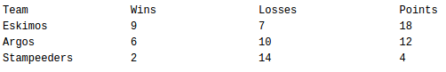

# processing-console-assignment-2-formatting-text-output

## Step 1
1. Create a String variable called `team1name`. See https://processing.org/reference/String.html for reference of how to declare and use strings in Processing.
2. Put the name of a team into the variable, e.g. `team1name = "Edmonton Oilers"`.
3. Print the following statement to console: "The first team is called (replace with the content of the `team1name` variable)".
4. Repeat the above for 2 more teams. Use `team2name` and `team3name`.

## Step 2
Create an integer (int) variables for the wins and losses of the three teams and decide how many wins and losses each should have. For example: `int team1Wins = 9;` and `int team1Losses= 7;`. Do this for all tree teams.

## Step 3
Create threeore integer variables to store the total points for each team (such as `team1points`). The points should be calculated using a formula. One possible formula for calculating total points is number of wins * 2.  Make sure you use the `team?wins` variable in your formula.

## Step 4
Print a title line for your table: (use \t to indicate a tab in a println statement):
>        Team                 Wins                Losses                        Points

## Step 5
And now the hard part... Using the variables, fill out the table. In other words, FOR EACH TEAM, you will need one println statement.  Your println statements should contain something like: `(variable + “ \t“ +  variable + “ \t“ + variable + “ \t“ + variable)`. Overall, your table should look similar to the following:

Note that the columns have to line up (hint: use the tab escape character, see assignment 1)
